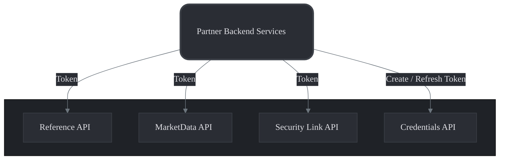
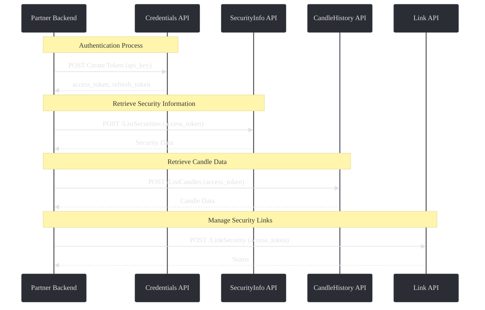

Whether you're a developer looking to retrieve market data or manage your own securities, this documentation will help you get started quickly.

<Warning>The Partner API is under active development.</Warning>

> **Improvement suggestions:** We welcome your feedback and suggestions for improving our APIs. Please reach out to us at [support@takeprofit.com](mailto:support@takeprofit.com) with any suggestions or questions.

## Overview

The TakeProfit APIs provide partners with financial data and integration tools. Our APIs include:

<CardGroup cols={3}>
	<Card
		title="Security Linking"
		icon="link"
		href="/docs/partner/link"
	>
		Manage the linkage between your own securities and those provided by
		TakeProfit.
	</Card>
	<Card
		title="Reference Data"
		icon="book-atlas"
		href="/docs/partner/reference-api"
	>
		Retrieve detailed information on financial instruments, exchanges, and other
		entities.
	</Card>
	<Card
		title="Market Data"
		icon="chart-candlestick"
		href="/docs/partner/marketdata-api"
	>
		Access real-time and historical market data across various asset classes.
	</Card>
</CardGroup>

This suite ensures seamless access to essential data and simplifies integration with partner systems.

## High-Level Workflow



## Workflow Example



---

## Credentials API

The **Credentials API** is your entry point. It allows you to authenticate and receive tokens for accessing other APIs securely.

### Usage Flow

1. **Create Token**: Send your `api_key` to receive tokens.
2. **Refresh Token**: Use the `refresh_token` to obtain a new `access_token` when needed.

> **Note:** The lifetime of the `access_token` is 30 minutes.

### Example: Logging In

```bash
curl --location 'https://{{PARTNER_API_URL}}/takeprofit.partner.external.auth.v1.AuthApi.Login' \
--header 'Content-Type: application/json' \
--data '{
    "api_key": "YOUR_API_KEY_HERE"
}'
```

**Response**

```json
{
	"status": {
		"code": 0,
		"message": "",
		"details": []
	},
	"access_token": {
		"token": "ACCESS_TOKEN",
		"valid_to_time": "2024-10-30T12:57:25Z"
	},
	"refresh_token": {
		"token": "REFRESH_TOKEN",
		"valid_to_time": "2024-10-30T14:27:25Z"
	}
}
```

> **Note:** Keep your tokens secure and never expose them publicly.

---

## Best Practices

### Secure Storage

- **Protect Credentials**: Store your `api_key`, `access_token`, and `refresh_token` securely.
- **Avoid Exposure**: Do not expose tokens in client-side code or public repositories.

### Token Management

- **Monitor Expiration**: Keep track of token `valid_to_time` to refresh tokens proactively. Token lifetime is 30 minutes.
- **Handle Failures**: Implement retry logic for token refresh failures.

### Error Handling

- **Check Status Codes**: Always check the `status.code` in responses.
- **Log Errors**: Log error messages for troubleshooting, but avoid logging sensitive information.

### Rate Limiting

- **Be Mindful**: Respect any rate limits to avoid service interruptions.
- **Implement Backoff**: Use exponential backoff strategies when retrying requests.

---

## FAQs

### How do I obtain an `api_key`?

Contact our sales team at [support@takeprofit.com](mailto:support@takeprofit.com) to obtain your unique `api_key`.

### What should I do if my `access_token` expires?

Use the `refresh_token` with the Auth API's `Refresh` method to obtain a new `access_token`.

**Example: Refreshing Token**

```bash
curl --location 'https://api.dev.tpinf.in/takeprofit.partner.external.auth.v1.AuthApi.Refresh' \
--header 'Content-Type: application/json' \
--data '{
    "refresh_token": "YOUR_REFRESH_TOKEN_HERE"
}'
```

### Are all times in UTC?

Yes, all times provided by the APIs are in UTC.

## Feedback

We value your feedback! If you have suggestions or find any issues, please let us know at [support@takeprofit.com](mailto:support@takeprofit.com).
